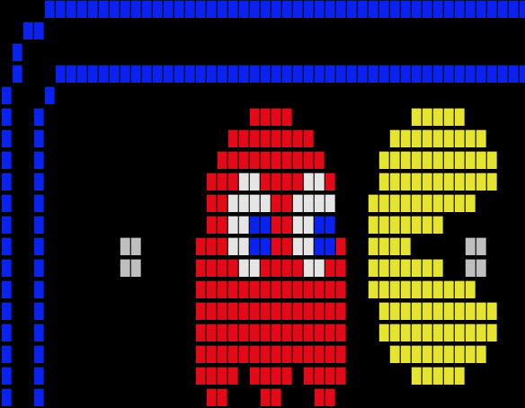

# Pacman For Terminals in Rust
Pacman emulator for Terminals in Rust

## Self Playing
 * cargo run
 * cargo run 50 120
 * cargo run $(stty size)

## Interactive (VI keys)
 * stty raw -echo; cargo run $(stty size); stty echo cooked

